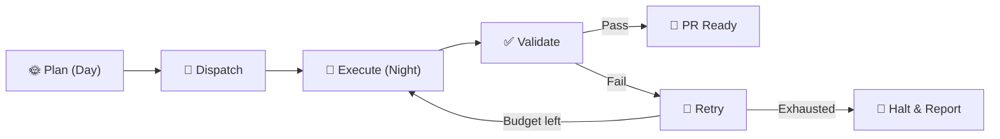
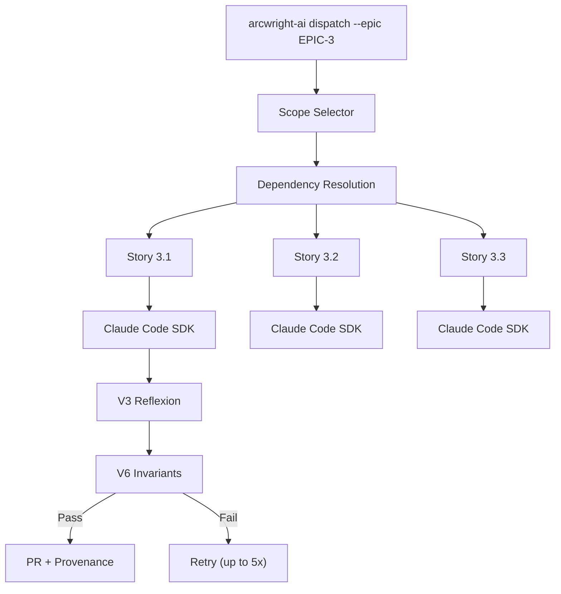
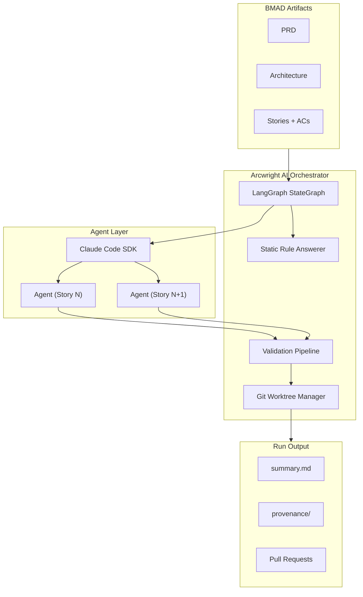

# Arcwright AI

> **Design by day, execute by night.**

A methodology-agnostic agent orchestration platform that automates multi-stage software development workflows, enforces deterministic validation gates around non-deterministic AI agent output, and provides full observability and traceability via [LangGraph](https://langchain-ai.github.io/langgraph/).

Ships with the [BMAD Method](https://github.com/bmadcode/BMAD-METHOD) as its reference implementation — but any team can encode their own development methodology as executable workflows.



## Table of Contents

- [Why Arcwright AI](#why-arcwright-ai)
- [How It Works](#how-it-works)
- [Key Features](#key-features)
- [Architecture Overview](#architecture-overview)
- [Getting Started](#getting-started)
- [CLI Reference](#cli-reference)
- [Configuration](#configuration)
- [Python API](#python-api)
- [Project Status](#project-status)
- [Contributing](#contributing)
- [License](#license)

## Why Arcwright AI

AI coding agents are capable. The [BMAD Method](https://github.com/bmadcode/BMAD-METHOD) solves context management — structured methodology that produces comprehensive planning artifacts. What's missing is **autonomous execution at velocity**.

Today, developers manually shepherd AI agents through workflows one conversation at a time — sequential, unvalidated, and unobservable. The ceiling isn't agent intelligence — it's human throughput as the orchestration layer.

Arcwright AI wraps a **deterministic shell around non-deterministic agents**, enabling you to:

- Plan collaboratively during the day (brainstorming, PRDs, architecture, stories)
- Dispatch automated execution overnight across multiple epics and stories
- Wake up to completed, validated, traceable work

**The three-piece puzzle:**

| Piece | Role |
|-------|------|
| **AI Agents** (Claude Code) | Capability — execute individual tasks |
| **BMAD Method** | Context — structured planning artifacts that give agents everything they need |
| **Arcwright AI** | Velocity — autonomous orchestration that converts plans into working code |

## How It Works

Arcwright AI provides a LangGraph-based orchestration engine with four internal subsystems behind one CLI entry point:

1. **Orchestration Engine** — LangGraph StateGraph for workflow DAG execution with deterministic state transitions
2. **Validation Framework** — artifact-specific validation patterns with retry budgets (V3 reflexion + V6 invariant checks)
3. **Process Runtime** — Claude Code SDK for stateless agent invocation (one fresh session per command)
4. **SCM Integration** — git worktree isolation for safe, parallel agent execution



## Key Features

### Decision Provenance

Every execution produces a complete reasoning trail — what was decided, what was rejected, and why. Code review of AI-generated PRs becomes decision-centric ("Do I agree with the choices?") instead of line-by-line reading.

### Fail Loud, Fail Visible

The system halts an epic on unrecoverable failure — no silent breakage, no partial work masquerading as complete. The halt summary reports what succeeded, what failed, why, and exactly where to resume.

### Trust Through Transparency

Unlike black-box autonomous agents, every decision is logged, every output is validated, every workflow step is observable. You choose exactly what work to dispatch — down to individual stories.

### Scope Control

Granular, user-controlled scope selection:

```bash
# Dispatch an entire epic
arcwright-ai dispatch --epic EPIC-3

# Dispatch a single story
arcwright-ai dispatch --story STORY-3.1

# Resume a halted epic from the failure point
arcwright-ai dispatch --epic EPIC-3 --resume
```

### Validation Pipeline

Six validation patterns ordered by cost, with artifact-specific pipelines:

| Pattern | Description | Use Case |
|---------|-------------|----------|
| **V1** | BMAD native validators | Cross-doc validation workflows |
| **V2** | LLM-as-Judge | Independent model scoring |
| **V3** | Reflexion | Agent self-critique + revise loop |
| **V4** | Cross-document consistency | Artifact agreement checks |
| **V5** | Multi-perspective ensemble | Parallel persona review |
| **V6** | Invariant checks | Static rule-based assertions |

### Cost Tracking

Per-story and per-run cost tracked and reported. You always know what an overnight run costs.

## Architecture Overview



**Technology stack:**

- **Python 3.11+** — core runtime
- **LangGraph** — workflow DAG execution, state management, observability
- **Claude Code SDK** — stateless AI agent invocation
- **Git** (2.25+) — worktree isolation, branch management, PR generation
- **Pydantic** — config validation, state models
- **Click/Typer** — CLI framework

## Getting Started

### Prerequisites

- Python 3.11 or later
- Git 2.25 or later
- A Claude API key
- A project with BMAD planning artifacts (PRD, architecture, stories with acceptance criteria)

### Installation

```bash
pip install arcwright-ai
```

### Quick Start

1. **Initialize** your project:

   ```bash
   arcwright-ai init
   ```

   This scaffolds the `.arcwright-ai/` directory, generates a default config, adds temp/run directories to `.gitignore`, and detects existing BMAD artifacts.

2. **Configure** your API key:

   ```bash
   export ARCWRIGHT_API_CLAUDE_API_KEY="sk-ant-..."
   ```

   Or add it to `~/.arcwright-ai/config.yaml`:

   ```yaml
   api:
     claude_api_key: "sk-ant-..."
   ```

3. **Validate** your setup:

   ```bash
   arcwright-ai validate-setup
   ```

   Expect output like:

   ```
   ✅ Claude API key: valid
   ✅ BMAD project structure: detected at ./_spec/
   ✅ Planning artifacts: PRD, architecture, epics found
   ✅ Story artifacts: 12 stories with acceptance criteria
   ✅ Arcwright AI config: valid
   Ready for dispatch.
   ```

4. **Dispatch** your first run:

   ```bash
   arcwright-ai dispatch --story STORY-1.1
   ```

5. **Review** results in `.arcwright-ai/runs/<run-id>/summary.md`

## CLI Reference

### MVP Commands

| Command | Description |
|---------|-------------|
| `arcwright-ai init` | Scaffold `.arcwright-ai/`, generate default config, detect BMAD artifacts |
| `arcwright-ai dispatch --epic EPIC-N` | Dispatch full epic for sequential autonomous execution |
| `arcwright-ai dispatch --epic EPIC-N --resume` | Resume a halted epic from the failure point |
| `arcwright-ai dispatch --story STORY-N.N` | Dispatch a single story |
| `arcwright-ai validate-setup` | Validate config, API key, project structure |
| `arcwright-ai status [--run RUN-ID]` | Show current/last run status with cost summary |
| `arcwright-ai cleanup` | Clean up git worktrees |

### Exit Codes

| Code | Meaning |
|------|---------|
| `0` | Success |
| `1` | General error |
| `2` | Validation failure (max retries exhausted) |
| `3` | Cost cap reached (graceful halt) |
| `4` | Configuration error |
| `5` | Timeout |

All commands are composable in shell scripts:

```bash
arcwright-ai dispatch --epic EPIC-3 && notify-slack "done"
```

## Configuration

Arcwright AI uses a two-tier configuration model with environment variable overrides.

**Precedence:** env var > project config > global config > defaults

### Global Config (`~/.arcwright-ai/config.yaml`)

```yaml
api:
  claude_api_key: "sk-..."
model:
  version: "claude-sonnet-4-20250514"
limits:
  tokens_per_story: 100000
  cost_per_run: 50.00
  timeout_per_story: 1800
```

### Project Config (`.arcwright-ai/config.yaml`)

```yaml
methodology:
  artifacts_path: "./_spec"
  type: "bmad"
scm:
  branch_template: "arcwright-ai/{epic}/{story}"
limits:
  tokens_per_story: 80000
  cost_per_run: 25.00
  retry_budget: 10.00
  timeout_per_story: 3600
reproducibility:
  enabled: true
  retention: "last-10-runs"
```

### Environment Variables

| Variable | Purpose |
|----------|---------|
| `ARCWRIGHT_API_CLAUDE_API_KEY` | Claude API key (avoids committing keys to config) |
| `ARCWRIGHT_AI_MODEL_VERSION` | Override model version |

## Python API

The CLI is a thin wrapper around a programmatic Python API:

```python
from arcwright_ai import Orchestrator

o = Orchestrator()
o.dispatch(epic="EPIC-3")
o.dispatch(story="STORY-3.1")
o.status(run_id="RUN-2026-02-26")
o.cost(run_id="RUN-2026-02-26")
o.cleanup()
```

## Project Status

Arcwright AI is in **active development** and [available on PyPI](https://pypi.org/project/arcwright-ai/). MVP is complete — the sequential pipeline, V3+V6 validation, decision provenance, halt-and-notify, cost tracking, resume, SCM integration with auto-merge, role-based model registry, and dynamic versioning are all implemented. Automated publishing via GitHub Actions triggers on version tags.

### Roadmap

| Phase | Focus |
|-------|-------|
| **MVP** | Sequential pipeline, V3+V6 validation, decision provenance, halt-and-notify, cost tracking, `--resume` |
| **Growth** | Observe mode, deterministic replay, cost enforcement, parallel execution, public Python API, generated docs |
| **Vision** | Methodology-agnostic orchestration, multi-user/team coordination, web UI, community workflow marketplace |

## BMAD Workflow Customizations

This project maintains customizations to the default BMAD dev-story workflow. These changes live in `_bmad/bmm/workflows/4-implementation/dev-story/` and are applied manually after each BMAD framework upgrade.

### Why `_bmad/` is gitignored

The BMAD framework is installed *into* a project, not built alongside it. It ships as a set of files dropped into `_bmad/` by the BMAD installer/updater. Because these files are owned by the framework distribution rather than the application project, the standard BMAD `.gitignore` excludes all of `_bmad/` — just as you would not commit `node_modules/` or a Python `.venv`. Committing them would create merge conflicts every time BMAD releases an update.

### What is customized and why

| File | Change | Reason |
|------|--------|--------|
| `_bmad/bmm/workflows/4-implementation/dev-story/instructions.xml` | Added Step 3 (review-continuation detection), git diff reconciliation audit in Step 9, enhanced review follow-up handling in Step 8, and expanded completion/communication steps | 8 of 12 stories across Epics 2–4 (67%) had Dev Agent Record File Lists that did not match the files actually changed. The audit runs `git diff --name-only HEAD`, compares against the story's File List, and blocks code-review submission until all discrepancies are resolved. Review-continuation detection was added to preserve context when resuming after a code review. |
| `_bmad/bmm/workflows/4-implementation/dev-story/checklist.md` | Replaced stock checklist with an enhanced Definition of Done checklist: added emoji section headers, `[AI-Review]` review follow-up tracking items, a git diff File List reconciliation requirement, a Final Validation Output block with template variables, and a Story Structure Compliance item | Keeps the Definition of Done checklist in sync with the automated enforcement added to `instructions.xml`, and adds explicit review follow-up tracking to close the loop between code review findings and story completion. |

### Re-applying after a BMAD update

A BMAD framework update (via `npx bmad-method@<version> install` or equivalent) will overwrite the customized files above with stock originals. Re-apply the customizations manually after each upgrade — the current working state of both files is always in `_bmad/` and serves as the live reference.

**Symptom of missing customizations:** Dev agent File Lists stop matching `git diff` output, or the agent no longer detects review-continuation context after a code review. See the troubleshooting entry in [`arcwright-ai/README.md`](arcwright-ai/README.md#dev-agent-file-list-is-consistently-incomplete-or-doesnt-match-git-diff-output-after-a-bmad-update).

## Contributing

Arcwright AI is open-source and welcomes contributions. Whether you're fixing bugs, adding features, improving documentation, or contributing workflow definitions for your own methodology — all contributions are valued.

### Development Setup

```bash
git clone https://github.com/ProductEngineerIO/arcwright-ai.git
cd arcwright-ai
pip install -e .
```

### Areas of Interest

- **Core orchestration** — LangGraph state machine, pipeline execution
- **Validation patterns** — new validators, artifact-specific pipelines
- **Workflow definitions** — encode your team's development methodology as an executable workflow
- **Documentation** — guides, tutorials, API reference improvements

### Versioning & Releases

Arcwright AI uses [hatch-vcs](https://github.com/ofek/hatch-vcs) for automatic versioning from git tags. **No files need editing to cut a release.**

**How versions are resolved:**

| Repo state | Resolved version | Example |
|------------|-----------------|---------|
| Exactly on a tag | Tag version | `v0.2.0` → `0.2.0` |
| N commits after a tag | Next-patch dev build | 3 commits after `v0.2.0` → `0.2.1.dev3` |
| No tags at all | `0.0.0.dev<N>` | fallback for fresh clones without history |

**Merging a PR to `main` does NOT create a new version tag.** Every commit on `main` after the last tag automatically gets a PEP 440 dev version (e.g., `0.2.1.dev5`). This is the expected state between releases.

**To cut a release:**

```bash
# 1. Ensure main is clean and CI is green
git checkout main && git pull

# 2. Create an annotated tag (the ONLY step that matters)
git tag -a v0.2.0 -m "v0.2.0 — brief description of what's in this release"

# 3. Push the tag
git push origin v0.2.0
```

That's it. The next `pip install` or wheel build will report `0.2.0`.

**Version scheme:** `guess-next-dev` with `no-local-version` — produces clean PyPI-compatible versions with no `+gABCDEF` local identifiers.

**Rollback:** If hatch-vcs causes issues, revert to a static `version = "X.Y.Z"` in `pyproject.toml` and a hardcoded `__version__` in `__init__.py`. No application code depends on the versioning mechanism.

### Community Workflow Definitions

The long-term vision is a community where every methodology trapped in someone's head or a wiki becomes an executable workflow. If you have a structured development process, consider encoding it as an Arcwright AI workflow definition.

## License

This project is licensed under the MIT License — see the [LICENSE](LICENSE) file for details.