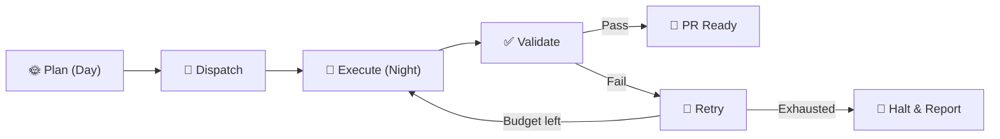
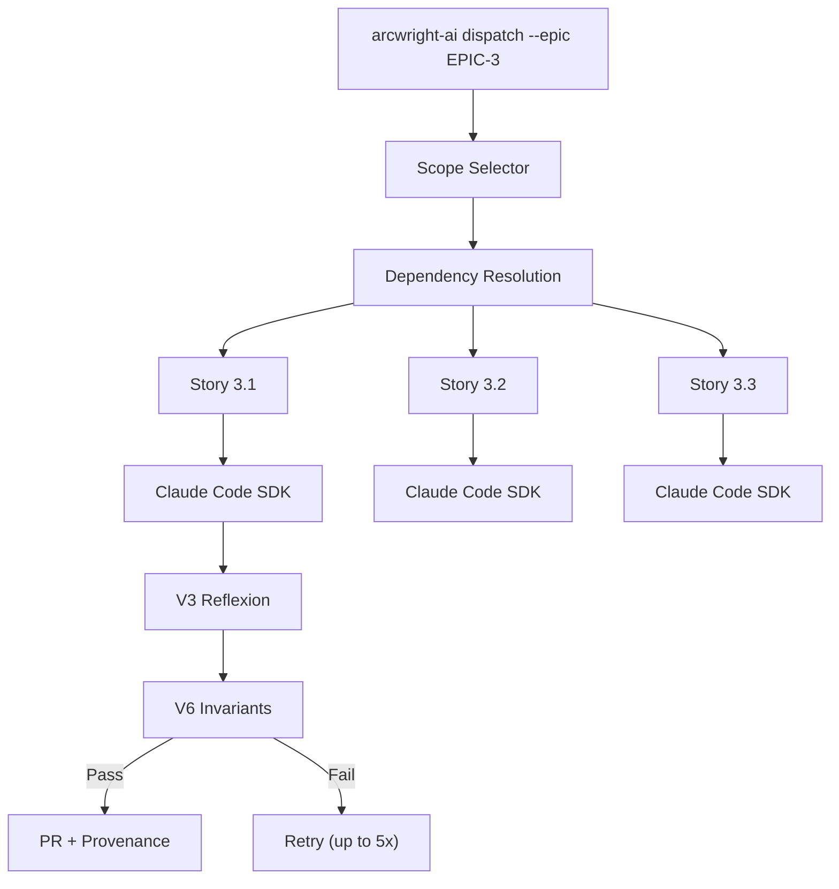
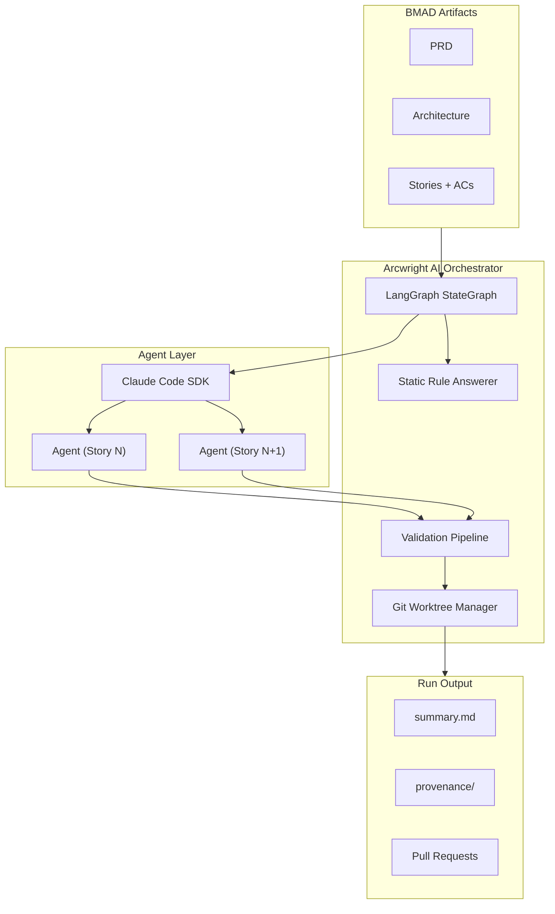

# Arcwright AI

> **Design by day, execute by night.**

A methodology-agnostic agent orchestration platform that automates multi-stage software development workflows, enforces deterministic validation gates around non-deterministic AI agent output, and provides full observability and traceability via [LangGraph](https://langchain-ai.github.io/langgraph/).

Ships with the [BMAD Method](https://github.com/bmadcode/BMAD-METHOD) as its reference implementation — but any team can encode their own development methodology as executable workflows.



## Table of Contents

- [Why Arcwright AI](#why-arcwright-ai)
- [How It Works](#how-it-works)
- [Key Features](#key-features)
- [Architecture Overview](#architecture-overview)
- [Getting Started](#getting-started)
- [CLI Reference](#cli-reference)
- [Configuration](#configuration)
- [Python API](#python-api)
- [Project Status](#project-status)
- [Contributing](#contributing)
- [License](#license)

## Why Arcwright AI

AI coding agents are capable. The [BMAD Method](https://github.com/bmadcode/BMAD-METHOD) solves context management — structured methodology that produces comprehensive planning artifacts. What's missing is **autonomous execution at velocity**.

Today, developers manually shepherd AI agents through workflows one conversation at a time — sequential, unvalidated, and unobservable. The ceiling isn't agent intelligence — it's human throughput as the orchestration layer.

Arcwright AI wraps a **deterministic shell around non-deterministic agents**, enabling you to:

- Plan collaboratively during the day (brainstorming, PRDs, architecture, stories)
- Dispatch automated execution overnight across multiple epics and stories
- Wake up to completed, validated, traceable work

**The three-piece puzzle:**

| Piece | Role |
|-------|------|
| **AI Agents** (Claude Code) | Capability — execute individual tasks |
| **BMAD Method** | Context — structured planning artifacts that give agents everything they need |
| **Arcwright AI** | Velocity — autonomous orchestration that converts plans into working code |

## How It Works

Arcwright AI provides a LangGraph-based orchestration engine with four internal subsystems behind one CLI entry point:

1. **Orchestration Engine** — LangGraph StateGraph for workflow DAG execution with deterministic state transitions
2. **Validation Framework** — artifact-specific validation patterns with retry budgets (V3 reflexion + V6 invariant checks)
3. **Process Runtime** — Claude Code SDK for stateless agent invocation (one fresh session per command)
4. **SCM Integration** — git worktree isolation for safe, parallel agent execution



## Key Features

### Decision Provenance

Every execution produces a complete reasoning trail — what was decided, what was rejected, and why. Code review of AI-generated PRs becomes decision-centric ("Do I agree with the choices?") instead of line-by-line reading.

### Fail Loud, Fail Visible

The system halts an epic on unrecoverable failure — no silent breakage, no partial work masquerading as complete. The halt summary reports what succeeded, what failed, why, and exactly where to resume.

### Trust Through Transparency

Unlike black-box autonomous agents, every decision is logged, every output is validated, every workflow step is observable. You choose exactly what work to dispatch — down to individual stories.

### Scope Control

Granular, user-controlled scope selection:

```bash
# Dispatch an entire epic
arcwright-ai dispatch --epic EPIC-3

# Dispatch a single story
arcwright-ai dispatch --story STORY-3.1

# Resume a halted epic from the failure point
arcwright-ai dispatch --epic EPIC-3 --resume
```

### Validation Pipeline

Six validation patterns ordered by cost, with artifact-specific pipelines:

| Pattern | Description | Use Case |
|---------|-------------|----------|
| **V1** | BMAD native validators | Cross-doc validation workflows |
| **V2** | LLM-as-Judge | Independent model scoring |
| **V3** | Reflexion | Agent self-critique + revise loop |
| **V4** | Cross-document consistency | Artifact agreement checks |
| **V5** | Multi-perspective ensemble | Parallel persona review |
| **V6** | Invariant checks | Static rule-based assertions |

### Cost Tracking

Per-story and per-run cost tracked and reported. You always know what an overnight run costs.

## Architecture Overview



**Technology stack:**

- **Python 3.11+** — core runtime
- **LangGraph** — workflow DAG execution, state management, observability
- **Claude Code SDK** — stateless AI agent invocation
- **Git** (2.25+) — worktree isolation, branch management, PR generation
- **Pydantic** — config validation, state models
- **Click/Typer** — CLI framework

## Getting Started

### Prerequisites

- Python 3.11 or later
- Git 2.25 or later
- A Claude API key
- A project with BMAD planning artifacts (PRD, architecture, stories with acceptance criteria)

### Installation

```bash
pip install arcwright-ai
```

### Quick Start

1. **Initialize** your project:

   ```bash
   arcwright-ai init
   ```

   This scaffolds the `.arcwright-ai/` directory, generates a default config, adds temp/run directories to `.gitignore`, and detects existing BMAD artifacts.

2. **Configure** your API key:

   ```bash
   export ARCWRIGHT_AI_API_KEY="sk-..."
   ```

   Or add it to `~/.arcwright-ai/config.yaml`:

   ```yaml
   api:
     claude_api_key: "sk-..."
   ```

3. **Validate** your setup:

   ```bash
   arcwright-ai validate-setup
   ```

   Expect output like:

   ```
   ✅ Claude API key: valid
   ✅ BMAD project structure: detected at ./_spec/
   ✅ Planning artifacts: PRD, architecture, epics found
   ✅ Story artifacts: 12 stories with acceptance criteria
   ✅ Arcwright AI config: valid
   Ready for dispatch.
   ```

4. **Dispatch** your first run:

   ```bash
   arcwright-ai dispatch --story STORY-1.1
   ```

5. **Review** results in `.arcwright-ai/runs/<run-id>/summary.md`

## CLI Reference

### MVP Commands

| Command | Description |
|---------|-------------|
| `arcwright-ai init` | Scaffold `.arcwright-ai/`, generate default config, detect BMAD artifacts |
| `arcwright-ai dispatch --epic EPIC-N` | Dispatch full epic for sequential autonomous execution |
| `arcwright-ai dispatch --epic EPIC-N --resume` | Resume a halted epic from the failure point |
| `arcwright-ai dispatch --story STORY-N.N` | Dispatch a single story |
| `arcwright-ai validate-setup` | Validate config, API key, project structure |
| `arcwright-ai status [--run RUN-ID]` | Show current/last run status with cost summary |
| `arcwright-ai cleanup` | Clean up git worktrees |

### Exit Codes

| Code | Meaning |
|------|---------|
| `0` | Success |
| `1` | General error |
| `2` | Validation failure (max retries exhausted) |
| `3` | Cost cap reached (graceful halt) |
| `4` | Configuration error |
| `5` | Timeout |

All commands are composable in shell scripts:

```bash
arcwright-ai dispatch --epic EPIC-3 && notify-slack "done"
```

## Configuration

Arcwright AI uses a two-tier configuration model with environment variable overrides.

**Precedence:** env var > project config > global config > defaults

### Global Config (`~/.arcwright-ai/config.yaml`)

```yaml
api:
  claude_api_key: "sk-..."
model:
  version: "claude-sonnet-4-20250514"
limits:
  tokens_per_story: 100000
  cost_per_run: 50.00
  timeout_per_story: 1800
```

### Project Config (`.arcwright-ai/config.yaml`)

```yaml
methodology:
  artifacts_path: "./_spec"
  type: "bmad"
scm:
  branch_template: "arcwright-ai/{epic}/{story}"
limits:
  tokens_per_story: 80000
  cost_per_run: 25.00
  retry_budget: 10.00
  timeout_per_story: 3600
reproducibility:
  enabled: true
  retention: "last-10-runs"
```

### Environment Variables

| Variable | Purpose |
|----------|---------|
| `ARCWRIGHT_AI_API_KEY` | Claude API key (avoids committing keys to config) |
| `ARCWRIGHT_AI_MODEL_VERSION` | Override model version |

## Python API

The CLI is a thin wrapper around a programmatic Python API:

```python
from arcwright_ai import Orchestrator

o = Orchestrator()
o.dispatch(epic="EPIC-3")
o.dispatch(story="STORY-3.1")
o.status(run_id="RUN-2026-02-26")
o.cost(run_id="RUN-2026-02-26")
o.cleanup()
```

## Project Status

Arcwright AI is in **active early development** (pre-MVP). The project is currently in the planning phase — product brief and PRD are complete. Architecture, epics, and story breakdown are next.

### Roadmap

| Phase | Focus |
|-------|-------|
| **MVP** | Sequential pipeline, V3+V6 validation, decision provenance, halt-and-notify, cost tracking, `--resume` |
| **Growth** | Observe mode, deterministic replay, cost enforcement, parallel execution, public Python API, generated docs |
| **Vision** | Methodology-agnostic orchestration, multi-user/team coordination, web UI, community workflow marketplace |

## BMAD Workflow Customizations

This project ships with customizations to the default BMAD dev-story workflow. These changes live in `_bmad/mmm/workflows/4-implementation/dev-story/` and are tracked by force-adding them to git (the `_bmad/` directory is otherwise gitignored, matching the standard BMAD installation model).

### Why `_bmad/` is gitignored

The BMAD framework is installed *into* a project, not built alongside it. It ships as a set of files dropped into `_bmad/` by the BMAD installer/updater. Because these files are owned by the framework distribution rather than the application project, the standard BMAD `.gitignore` excludes all of `_bmad/` — just as you would not commit `node_modules/` or a Python `.venv`. Committing them would create merge conflicts every time BMAD releases an update.

### What was customized and why

| File | Change | Reason |
|------|--------|--------|
| `_bmad/bmm/workflows/4-implementation/dev-story/instructions.xml` | Added git diff audit block in Step 9 | 8 of 12 stories across Epics 2–4 (67%) had Dev Agent Record File Lists that did not match the files actually changed. The audit runs `git diff --name-only HEAD`, compares against the story's File List, and blocks code-review submission until all discrepancies are resolved. |
| `_bmad/bmm/workflows/4-implementation/dev-story/checklist.md` | Updated "File List Complete" DoD item to reference the Step 9 audit | Keeps the Definition of Done checklist in sync with the automated enforcement added above. |

### ⚠️ Manual migration required after any BMAD update

Because `_bmad/` is gitignored, a BMAD framework update (via `bmad update` or equivalent) will **overwrite** the customized files above with the unmodified originals, silently losing these changes.

**After every BMAD update, re-apply the following changes manually:**

#### `_bmad/bmm/workflows/4-implementation/dev-story/instructions.xml` — Step 9

Locate the line `<action>Run the full regression suite (do not skip)</action>` inside `<step n="9">` and insert the following block immediately after it (before `<action>Execute enhanced definition-of-done validation</action>`):

```xml
<!-- GIT DIFF AUDIT: Reconcile actual changed files against Dev Agent Record File List -->
<action>Run: git diff --name-only HEAD to get all files changed since the last commit</action>
<action>Also run: git status --short to surface any untracked or unstaged files relevant to this story</action>
<action>Extract the current File List from Dev Agent Record → File List section of the story file</action>
<action>Compare the two lists:
  - Files in git diff output but NOT in File List  → Missing entries (must be added before review)
  - Files in File List but NOT in git diff output  → Phantom entries (verify intent or remove)
  - Files appearing in both                        → Confirmed ✅
</action>
<action>Output a reconciliation table: filename | in-git-diff | in-file-list | status</action>

<check if="any files appear in git diff but are absent from the File List">
  <output>⚠️  FILE LIST DISCREPANCY — Missing Entries
    The following changed files are NOT recorded in Dev Agent Record → File List:
    {{missing_files}}
    You MUST add these entries before the story can move to review.
  </output>
  <action>Update Dev Agent Record → File List to include all missing files (repo-root-relative paths)</action>
  <action>Re-save the story file after updating the File List</action>
</check>

<check if="any files appear in the File List but are absent from git diff output">
  <output>⚠️  FILE LIST DISCREPANCY — Phantom Entries
    The following files are listed in Dev Agent Record → File List but show no git changes:
    {{phantom_files}}
    Confirm these files were intentionally included (e.g. deletions tracked separately) or remove them.
  </output>
</check>

<check if="git diff output and File List match exactly">
  <output>✅ Git diff audit passed — all changed files are accounted for in the File List</output>
</check>

<action if="File List was updated during audit">Re-save the story file before proceeding</action>
```

#### `_bmad/bmm/workflows/4-implementation/dev-story/checklist.md` — File List item

Find the line:
```
- [ ] **File List Complete:** File List includes EVERY new, modified, or deleted file (paths relative to repo root)
```
Replace it with:
```
- [ ] **File List Complete:** File List includes EVERY new, modified, or deleted file (paths relative to repo root) — reconciled against `git diff --name-only HEAD` by the automated audit in Step 9
```

The two customized files are force-tracked in git (`git add -f`) so you always have a reference copy of what the correct state should look like:

```bash
git show HEAD:_bmad/bmm/workflows/4-implementation/dev-story/instructions.xml
git show HEAD:_bmad/bmm/workflows/4-implementation/dev-story/checklist.md
```

## Contributing

Arcwright AI is open-source and welcomes contributions. Whether you're fixing bugs, adding features, improving documentation, or contributing workflow definitions for your own methodology — all contributions are valued.

### Development Setup

```bash
git clone https://github.com/KLPTechCo/bmad-graph-swarm.git
cd bmad-graph-swarm
pip install -e .
```

### Areas of Interest

- **Core orchestration** — LangGraph state machine, pipeline execution
- **Validation patterns** — new validators, artifact-specific pipelines
- **Workflow definitions** — encode your team's development methodology as an executable workflow
- **Documentation** — guides, tutorials, API reference improvements

### Community Workflow Definitions

The long-term vision is a community where every methodology trapped in someone's head or a wiki becomes an executable workflow. If you have a structured development process, consider encoding it as an Arcwright AI workflow definition.

## License

This project is licensed under the MIT License — see the [LICENSE](LICENSE) file for details.