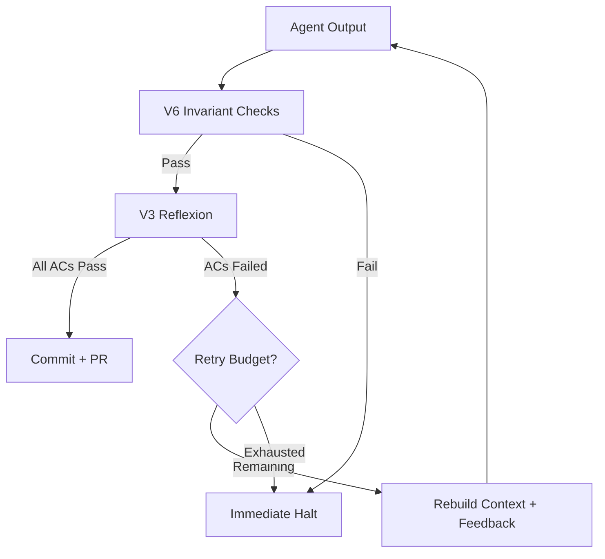
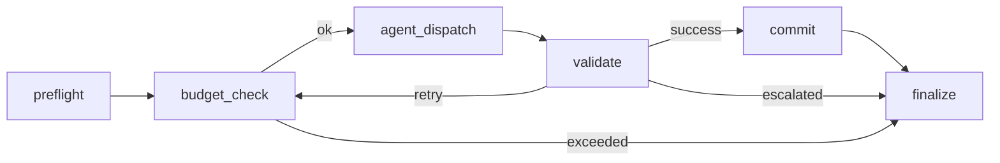
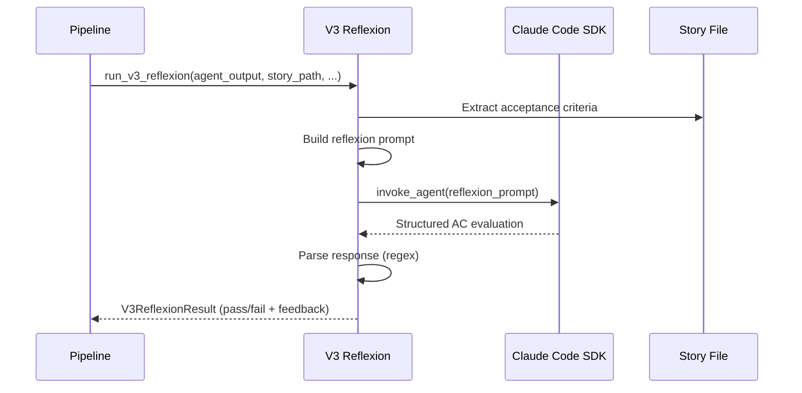
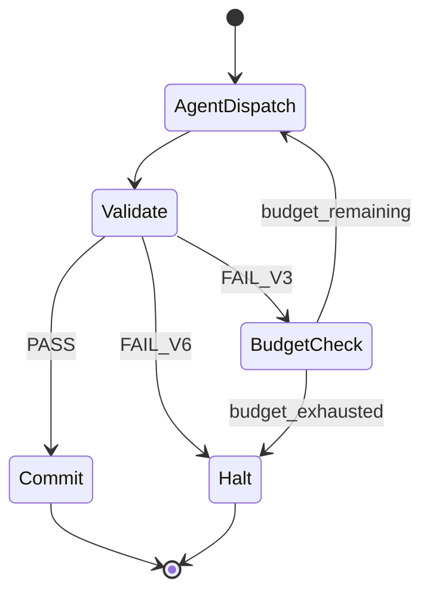

# Validation Pipeline

Arcwright AI validates every story's agent output through a two-stage pipeline before any code is committed. The pipeline enforces correctness deterministically (V6 invariant checks) and evaluates completeness via LLM self-critique (V3 reflexion). Validation failures either trigger retries with injected feedback or halt the run with a detailed report.



## Table of Contents

- [Pipeline Overview](#pipeline-overview)
- [V6 Invariant Checks](#v6-invariant-checks)
- [V3 Reflexion Validation](#v3-reflexion-validation)
- [Retry Mechanics](#retry-mechanics)
- [Halt and Escalation](#halt-and-escalation)
- [Validation Artifacts](#validation-artifacts)
- [Static Rule Answerer](#static-rule-answerer)
- [Configuration Reference](#configuration-reference)
- [Validation Patterns Roadmap](#validation-patterns-roadmap)

## Pipeline Overview

The validation pipeline runs after every agent invocation — both initial attempts and retries. It lives in `src/arcwright_ai/validation/pipeline.py` and orchestrates two sub-validators in sequence.

### Execution Order

1. **V6 invariant checks** run first — cheap, deterministic, zero tokens
2. If V6 fails → **immediate halt** (no retry, no V3)
3. If V6 passes → **V3 reflexion** runs (expensive, uses a separate LLM invocation)
4. If V3 passes → pipeline returns `PASS`
5. If V3 fails → pipeline returns `FAIL_V3` (retryable)

This ordering is deliberate: V6 catches structural violations that no amount of retrying can fix (missing files, syntax errors). Running V6 first avoids wasting tokens on V3 reflexion when the output is fundamentally broken.

### Pipeline Outcomes

| Outcome | Meaning | What Happens Next |
|---------|---------|-------------------|
| `PASS` | Both V6 and V3 passed | Commit node stages, commits, and pushes |
| `FAIL_V6` | Deterministic rule violation | Immediate halt — no retry |
| `FAIL_V3` | Acceptance criteria not met | Retry with feedback (if budget remains) |

### Where Validation Fits in the Graph



Validation always runs **before** commit. On success, the commit node stages all changes (including `validation.md`) and pushes the branch. On failure, no commit occurs — the agent's work remains on disk in the git worktree but is never pushed.

## V6 Invariant Checks

V6 checks are deterministic, rule-based assertions that run without any LLM calls. They verify structural correctness that the agent must get right on every attempt.

**Source:** `src/arcwright_ai/validation/v6_invariant.py`

### Active Checks

#### File Existence

Extracts every file path the agent claims to have created and verifies each one exists on disk.

**Detection patterns:**
- `## File: path/to/file.py` — markdown section headers
- `` ```python:path/to/file.py `` — fenced code block labels
- `- Created: path/to/file.py` — bullet list items

**Fails when:** Any declared file path does not exist relative to the project root.

**Example failure:**
```
[FAIL] file_existence: Missing files: src/arcwright_ai/new_module.py, tests/test_new_module.py
```

#### Naming Conventions

Validates that all Python file and directory names follow project conventions.

**Rules enforced:**
- Python filenames must be `snake_case` — pattern: `^[a-z][a-z0-9_]*\.py$`
- `__init__.py` is exempt
- Directory names must be `snake_case` (excludes `src`, `test`, `tests`, `__pycache__`)
- Test files inside `test/` or `tests/` directories must start with `test_`

**Fails when:** Any file or directory violates the naming pattern.

**Example failure:**
```
[FAIL] naming_conventions: MyModule.py violates snake_case; tests/check_output.py must start with test_
```

#### Python Syntax

Parses every `.py` file the agent touched using `ast.parse()`.

**Fails when:** Any Python file has a syntax error.

**Example failure:**
```
[FAIL] python_syntax: src/arcwright_ai/core/config.py: SyntaxError at line 42: unexpected indent
```

#### YAML Validity

Validates schema-constrained YAML files against required key sets.

**Files checked:** `sprint-status.yaml`, `config.yaml`, `run.yaml`

**Fails when:** Required keys are missing or values are invalid for the file type.

### Extending V6

V6 uses a check registry. You can add custom checks that conform to the `V6Check` protocol:

```python
from arcwright_ai.validation.v6_invariant import register_v6_check, V6CheckResult

async def check_custom_rule(
    agent_output: str,
    project_root: Path,
    story_path: Path,
) -> V6CheckResult:
    # Your validation logic here
    return V6CheckResult(check_name="custom_rule", passed=True)

register_v6_check(check_custom_rule)
```

Registered checks run automatically on the next validation cycle.

## V3 Reflexion Validation

V3 reflexion is an LLM-based self-critique loop. A separate, stateless Claude invocation evaluates the agent's output against the story's acceptance criteria (ACs).

**Source:** `src/arcwright_ai/validation/v3_reflexion.py`

### How It Works



1. **Extract ACs** — Parses the `## Acceptance Criteria` section from the story markdown into `(ac_id, ac_text)` tuples
2. **Build prompt** — Constructs instructions for the reviewer to evaluate each AC as PASS or FAIL with rationale
3. **Invoke SDK** — Calls `invoke_agent()` as a separate, stateless session (same model, working directory, and sandbox as the implementation agent)
4. **Parse response** — Regex-based extraction of structured verdicts:
   ```
   AC-1: PASS
   Rationale: The module exports all required types.

   AC-2: FAIL
   Rationale: The error handler does not cover timeout scenarios.
   Suggested Fix: Add a TimeoutError catch in the retry loop.
   ```
5. **Build feedback** — Maps failed ACs to their rationale and suggested fixes
6. **Return** — `V3ReflexionResult` containing the verdict, structured feedback, and token/cost usage

### What Happens on AC Failure

- Any AC marked FAIL → the overall V3 result is `passed=False`
- Missing ACs (not evaluated by the reviewer) are treated as FAIL with rationale "Reflexion did not evaluate this criterion"
- The `ReflexionFeedback` object captures:
  - `unmet_criteria` — list of failed AC IDs
  - `feedback_per_criterion` — dict mapping each failed AC to its rationale and suggested fix

### Token Accounting

V3 reflexion tokens are tracked separately and counted toward the "review" role's budget. Fields on `V3ReflexionResult`:
- `tokens_used` — total tokens
- `tokens_input` — prompt tokens
- `tokens_output` — completion tokens
- `cost` — estimated USD cost

## Retry Mechanics

When V3 reflexion fails and retry budget remains, the pipeline re-enters the agent dispatch loop with injected feedback.

### Retry Flow



1. `validate_node` receives `FAIL_V3` from the pipeline
2. It increments `retry_count` and checks against `retry_budget`
3. If retries remain → sets state to `RETRY`
4. The graph routes `RETRY` → `budget_check` → `agent_dispatch`
5. `agent_dispatch` reads `state.validation_result.feedback` and injects it into the agent prompt

### Feedback Injection

On retry, `build_prompt()` in `src/arcwright_ai/agent/prompt.py` appends a `## Previous Validation Feedback` section to the agent's prompt. This section contains:
- Which ACs failed
- The reviewer's rationale for each failure
- Suggested fixes

The agent receives a **fresh session** (stateless invocation) with the full context bundle plus this feedback. It does not see its prior output — it rebuilds from scratch with the additional guidance.

### What Triggers Immediate Halt (No Retry)

| Trigger | Reason |
|---------|--------|
| V6 invariant failure | Structural violation — retrying with the same constraints produces the same result |
| Agent SDK crash | Infrastructure failure, not an agent quality issue |
| Worktree creation failure | Git/filesystem problem |

### What Triggers Retry

| Trigger | Reason |
|---------|--------|
| V3 AC failure | Agent missed requirements — feedback injection may help |

### Budget Exhaustion

When `retry_count >= retry_budget`, the validate node escalates with reason `max_retries_exhausted` instead of retrying.

## Halt and Escalation

A halt stops the current story (and the entire epic if running in epic mode) and produces a detailed report for human review.

### Halt Reasons

| Reason | Trigger | Recovery Action |
|--------|---------|-----------------|
| `v6_invariant_failure` | V6 check failed | Fix the structural violation, re-run the story |
| `max_retries_exhausted` | V3 failed after all retry attempts | Address the unmet ACs manually or in the story spec, re-run |
| `budget_exceeded` | Token or cost ceiling hit | Increase budget limits in config, re-run |
| `agent_sdk_error` | Claude Code SDK invocation crashed | Check API key, network, SDK version — then retry |
| `preflight_worktree_creation_failed` | Git worktree could not be created | Debug git state or filesystem permissions |

### Epic-Level Halt Behavior

When dispatching an entire epic, a halt on any story stops the sequence. The halt report includes:
- Which stories completed successfully before the halt
- The failing story and its halt reason
- A resume command to pick up where it left off

Resume with:
```bash
python -m arcwright_ai dispatch --epic EPIC-N --resume
```

## Validation Artifacts

Every validation cycle writes structured artifacts to the run directory.

### validation.md

**Location:** `.arcwright-ai/runs/<run-id>/stories/<story-slug>/validation.md`

Contains the cumulative validation history across all attempts:

**Validation History** — table showing each attempt's result:
```markdown
| Attempt | Result | Feedback |
|---------|--------|----------|
| 1       | fail   | V3 reflexion failures: ACs 2, 3 |
| 2       | pass   | All checks passed (V6: 4 checks, V3: 4/4 ACs) |
```

**V6 Invariant Checks** — per-check pass/fail:
```markdown
- [PASS] file_existence
- [PASS] naming_conventions
- [PASS] python_syntax
- [PASS] yaml_validity
```

**V3 Reflexion Results** — per-AC verdicts (only present when V3 runs):
```markdown
- [PASS] AC 1: Module structure matches specification
- [FAIL] AC 2: Error handler missing timeout coverage
```

**Agent Decisions** — provenance entries with rationale for key decisions made during the run.

### halt-report.md

**Location:** `.arcwright-ai/runs/<run-id>/stories/<story-slug>/halt-report.md`

Only populated when a story escalates. Sections include:

- **Summary** — story ID, epic, run ID, status, halt reason, total attempts
- **Failing Acceptance Criteria** — which ACs were not met (V3 failures)
- **V6 Invariant Failures** — which structural checks failed
- **Retry History** — table of every attempt with outcome and failure details
- **Last Agent Output** — truncated excerpt from the final attempt
- **Suggested Fix** — actionable recommendations per failed criterion
- **Resume Command** — copy-paste command to resume the epic

## Static Rule Answerer

The answerer extracts project conventions from your BMAD planning artifacts without using an LLM. It acts as a pre-validation step — giving the agent the right conventions upfront so it's less likely to violate them.

**Source:** `src/arcwright_ai/context/answerer.py`

### How It Works

1. **Index** — `RuleIndex.build_index()` scans your BMAD spec directory and parses markdown documents into sections by heading
2. **Lookup** — `lookup(query)` does regex-based pattern matching against indexed headings and content
3. **Inject** — matched rules are placed into the agent's context bundle as a `## Project Conventions` section

### Example

If your architecture doc contains a section titled `### Python Naming Conventions` with content about snake_case usage, the answerer extracts it and injects it into the agent prompt. This helps the agent follow conventions during implementation, reducing V6 naming violations.

The answerer is not a validator itself — it's a context enrichment step that makes validation more likely to pass on the first attempt.

## Configuration Reference

### Validation-Related Settings

Configure in `.arcwright-ai/config.yaml` or via environment variables:

```yaml
limits:
  retry_budget: 3              # Max V3 validation retries per story
  tokens_per_story: 200000     # Max tokens per story (includes validation)
  cost_per_run: 10.0           # Max USD per epic run
  timeout_per_story: 300       # Max seconds per story
```

### Environment Variable Overrides

| Variable | Purpose | Default |
|----------|---------|---------|
| `ARCWRIGHT_LIMITS_RETRY_BUDGET` | Max V3 retry attempts | `3` |
| `ARCWRIGHT_LIMITS_COST_PER_RUN` | Cost ceiling in USD | `10.0` |
| `ARCWRIGHT_LIMITS_TOKENS_PER_STORY` | Token ceiling per story | `200000` |
| `ARCWRIGHT_LIMITS_TIMEOUT_PER_STORY` | Timeout in seconds | `300` |

### Precedence

Environment variables override project config, which overrides global config (`~/.arcwright-ai/config.yaml`), which overrides built-in defaults.

## Validation Patterns Roadmap

Arcwright AI defines six validation patterns. Two are implemented; four are planned for future releases.

| Pattern | Status | Description |
|---------|--------|-------------|
| **V1** | Planned | BMAD native validators — cross-document validation workflows as validator nodes |
| **V2** | Planned | LLM-as-Judge — a separate model scores output against explicit criteria |
| **V3** | **Implemented** | Reflexion — agent self-critique with structured AC evaluation |
| **V4** | Planned | Cross-document consistency — validate artifact agreement (architecture vs. PRD) |
| **V5** | Planned | Multi-perspective ensemble — parallel persona review where disagreement signals ambiguity |
| **V6** | **Implemented** | Invariant checks — deterministic, rule-based assertions (zero tokens) |

The patterns are ordered by cost. V6 (cheapest) runs first. V3 runs only when V6 passes. Future patterns will slot into the pipeline at appropriate cost points — for example, V1 might run between V6 and V3 as a medium-cost check.
